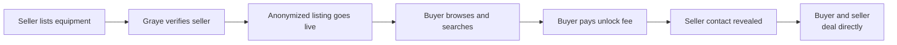

# Graye Market — Design Brief

Sep 23, 2026 · @broc

## Overview

Graye Market (graye.market) is a discreet marketplace for high-value heavy equipment, with machines worth tens of thousands to millions of dollars. Buyers browse anonymized listings for free and pay a flat fee to unlock a verified seller's contact details. The platform makes introductions only. It does not process sale payments or take a cut of the deal.

## Problem and value proposition

Buyers of expensive equipment waste time on unresponsive, unqualified or fake sellers. Sellers want serious buyers without broadcasting their identity or inventory publicly.

- **For buyers:** every seller is verified as the real owner and ready to sell, so a small unlock fee buys a genuine lead.
- **For sellers:** anonymity until a paying, serious buyer asks for contact, which filters out tire-kickers.
- **Core promise:** discreet, verified, and no commission on the sale.

## Users

| User | Who they are | What they need from the design |
| --- | --- | --- |
| Buyer | Contractors, dealers, operators and companies buying high-value equipment | Fast search, confidence the listing is real, a clear sense of what the unlock fee gets them |
| Repeat buyer | Dealers and brokers unlocking many listings | Subscription option, saved searches, an unlock history |
| Seller | Owners and dealers selling equipment discreetly | Simple listing flow, control over what is hidden, a verification process that feels credible rather than burdensome |

## How it works

Everything before the unlock is public but anonymized: specs, photos, condition, general location and price, with no seller name, company or contact. Everything after the unlock happens off-platform.

- **Anonymized listing:** photos must not reveal identifying details such as signage, plates or serial numbers. The design should prompt sellers about this at upload.
- **Refund rule:** if the seller doesn't respond within 72 hours of an unlock, the buyer is refunded automatically.

## Business model and pricing

Revenue comes from flat unlock fees scaled to the listing price. These are starting points to test, not final numbers.

| Listing price | Unlock fee |
| --- | --- |
| Under $100K | $99 |
| $100K–$500K | $249 |
| $500K–$2M | $499 |
| $2M+ | $999 |

- **Buyer subscription:** unlimited unlocks for repeat buyers, roughly $199–$499/month.
- **Seller upgrades:** basic listings are free; featured placement and dealer plans are paid.
- **Payments:** unlock fees and subscriptions are paid by card through Stripe Checkout. The sale itself never touches the platform.

## Key screens

1. **Home / landing:** explains the model in one glance (browse free, unlock verified sellers) with a search entry point.
2. **Search and results:** filters for category, make, model, year, hours, price range and region. Cards show a photo, key specs, price and a "Verified seller" badge.
3. **Listing detail:** full specs, photos and condition, with the seller block visibly locked. A clear unlock button shows the fee and what the buyer gets.
4. **Unlock checkout:** a short payment step stating the fee, the 72-hour response guarantee and the refund rule.
5. **Unlocked listing:** the revealed seller contact, plus a status showing whether the seller has responded.
6. **Seller onboarding and verification:** account setup, proof of ownership, and the verification status.
7. **Create or edit listing:** specs, photos with privacy guidance, price, and preview of the anonymized public view.
8. **Dashboards:** for buyers, unlocks, subscription and saved searches; for sellers, listings, unlock requests and plan.

The design should be responsive. Many buyers will browse from job sites on their phones.

## Brand direction

The brand should feel discreet, trustworthy and industrial: a private dealroom for serious equipment, not a classifieds site.

- **Name:** Graye Market, at graye.market. The "e" is deliberate and should read clearly in the logo, so people don't type "gray".
- **Avoid shady connotations.** "Gray market" is an industry term for unauthorized imports. Visual cues should point to verified and legitimate rather than underground.
- **Mood:** a restrained, gray-led palette with one confident accent color, clean type, and plenty of space. Heavy-equipment photography should do the visual work.
- **Voice:** plain, direct and professional. The audience is equipment buyers and dealers, not tech early adopters.

## Out of scope and open questions

Out of scope for launch: sale payments, escrow, commissions, in-app messaging, and shipping or inspection services.

- [ ] Should general location be shown as a state or as a region?
- [ ] Is the buyer subscription in the first release or added later?
- [ ] How much of the verification process should be visible to buyers (a badge only, or details)?
- [ ] Is there an existing logo or color preference, or is identity design part of this brief?
